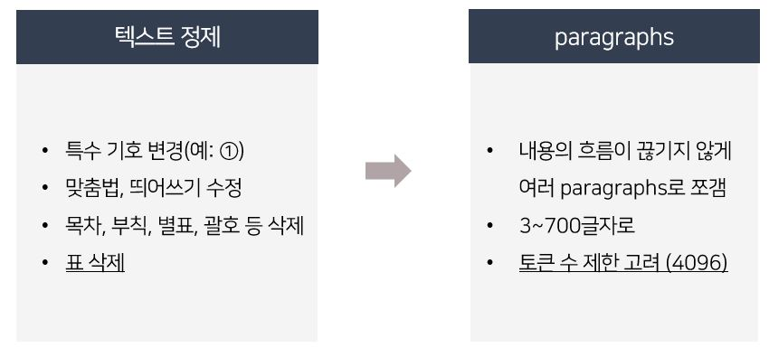
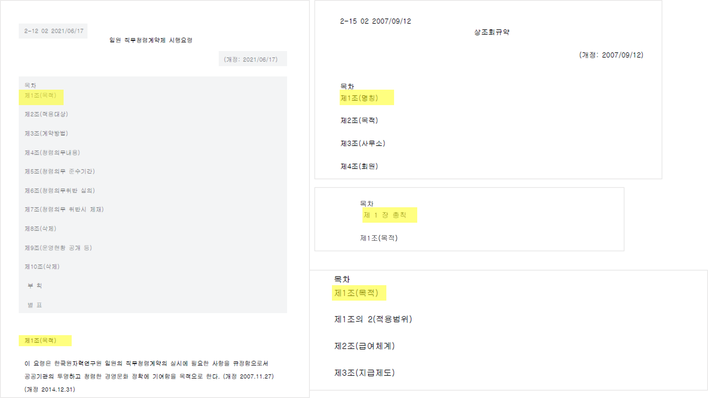
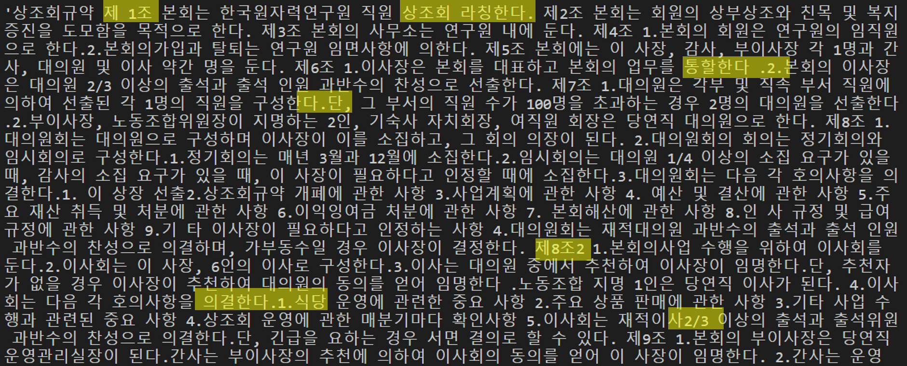

<!DOCTYPE html>
<html lang="ko">
<head>
  <meta charset="UTF-8">
</head>
<body>
  <h1>파동이봇 PROCESS</h1>
  <h1>🥴PDF 문서 처리 및 텍스트 정제</h1>
  
- PDF 파일을 불러온 뒤 텍스트를 분석하여 처리하는 기능을 제공 
  - 문서를 잘 추출하기 위한 사전 정리

   

   
  <h2>1️⃣ 주요 함수 및 클래스</h2>
  <ul>
    <li>
      <h3><code>circled_to_normal(char)</code></h3>
      
원형 숫자(예: ①)를 일반 숫자로 변환한다.
      
○, △를 ㅇ,ㅁ로 변환한다.

    </li>
    <li>
      <h3>Chatbot 클래스</h3>
      
이 클래스는 PDF 텍스트 분석 및 처리를 수행하는 기능을 제공한다.

      <ul>
        <li>
          <h4><code>parse_paper(pdf)</code></h4>
          
주어진 PDF 파일의 텍스트를 분석하여 정제한다.

        </li>
        <li>
            <h4><code>paper_df(pdf)</code></h4>
            
정제된 PDF 텍스트를 제*장, 제*조 단위로 나눈뒤 적절한 크기로 그룹화하여 데이터프레임으로 변환한다.

        </li>
    </ul>
    </li>
     </ul>
     
    <h2>2️⃣ 문제 상황</h2>
    1) 목차 삭제 
    <ul><li> <highlight style="background-color: #f5f5f5" color = "red" >&nbsp;목차&nbsp;</highlight> ~ 2번 째에 위치한 <highlight style="background-color: #f5f5f5" color = "red" >&nbsp;제1장&nbsp;</highlight> 또는 <highlight style="background-color: #f5f5f5" color = "red" >&nbsp;제1조&nbsp;</highlight>까지 삭제</li>
      </ul>
    2) 띄어쓰기, 부호 등 제대로 안 되어 있음. 
    <ul>  </ul>
    3) 문서 나누기 
    <li>PDF 문서 전체를 prompt에 입력하면, 토큰 개수 제한으로 오류 발생</li>
    <li>적절하게 문서를 나누는 것이 중요함</li>
     
    <h2>3️⃣ 임베딩</h2>
    <li><code>text-embedding-ada-002</code> 모델 활용</li>
    <li>유사도 계산을 위해 미리 벡터화해둠</li>
</body>
  
<h1>🔎검색 알고리즘을 활용한 문서 추출</h1>
<h2>1️⃣ 코사인 유사도(Cosine Similarity)</h2>
<ul><li> 내용 추가 예정</li></ul> 
<h2>2️⃣ BM25 (Best Match 25)</h2>
<ul><li> 내용 추가 예정</li></ul> 
👉🏻 총 3개의 Paragraph 추출
 
 
<h1>💬문서 기반의 답변 생성</h1>